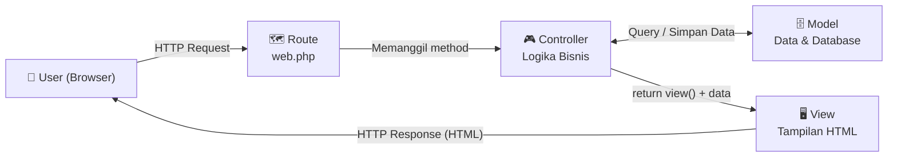
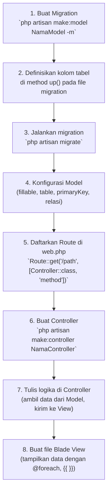

# Panduan Lengkap: Arsitektur MVC di Laravel

> Panduan ini disusun untuk membantu Anda memahami pola arsitektur **MVC (Model-View-Controller)** secara bertahap, mulai dari konsep dasar hingga implementasi kode nyata di Laravel.

---

## Bagian 1: Konsep Dasar MVC

### Apa itu MVC?

MVC adalah sebuah **pola arsitektur (architectural pattern)** yang memisahkan sebuah aplikasi menjadi tiga komponen utama. Tujuan utamanya adalah agar kode menjadi **lebih terorganisir, mudah dirawat, dan mudah dikembangkan** karena setiap bagian punya tanggung jawab yang jelas.

Bayangkan sebuah restoran:

- **Model** = Dapur (mengolah dan menyiapkan data/makanan)
- **View** = Meja makan (menampilkan hasil akhir ke pelanggan)
- **Controller** = Pelayan (menghubungkan pesanan pelanggan ke dapur, lalu membawa hasilnya ke meja)



### Tugas Spesifik Masing-masing Komponen

| Komponen       | Lokasi di Laravel       | Tanggung Jawab                                                                              |
| -------------- | ----------------------- | ------------------------------------------------------------------------------------------- |
| **Controller** | `app/Http/Controllers/` | Menerima _request_, mengolah logika bisnis, dan memutuskan _response_ apa yang dikembalikan |
| **Model**      | `app/Models/`           | Merepresentasikan tabel di database, tempat mendefinisikan aturan data, relasi, dan query   |
| **View**       | `resources/views/`      | Menampilkan data ke pengguna dalam format HTML (menggunakan Blade Templating)               |

> [!IMPORTANT]
> Prinsip terpenting MVC: **"Jangan campur aduk tanggung jawab!"**
>
> - Controller **tidak** boleh mengandung kode SQL mentah.
> - View **tidak** boleh mengandung logika bisnis yang kompleks.
> - Model **tidak** boleh berisi kode render HTML.

---

## Bagian 2: Pembuatan & Tugas Controller

### 2.1 Membuat Controller

Perintah `artisan` adalah CLI (Command Line Interface) bawaan Laravel untuk mempercepat pekerjaan developer.

```bash
# Membuat controller kosong
php artisan make:controller DosenController

# Membuat controller sekaligus dengan semua method CRUD (Resource)
php artisan make:controller DosenController --resource
```

Perintah ini akan otomatis membuat file baru di: `app/Http/Controllers/DosenController.php`

### 2.2 Menghubungkan Route dengan Controller

File `routes/web.php` adalah **"peta jalan"** aplikasi. Di sinilah kita mendaftarkan URL apa yang harus memanggil method apa di Controller mana.

```php
<?php
// routes/web.php

use App\Http\Controllers\DosenController;
use Illuminate\Support\Facades\Route;

// ---------------------------------------------------------------
// Cara 1: Menghubungkan satu URL ke satu method Controller
// ---------------------------------------------------------------

// Saat user mengakses GET /dosen, panggil method index() di DosenController
Route::get('/dosen', [DosenController::class, 'index'])->name('dosen.index');

// Saat user mengakses GET /dosen/tambah, panggil method tambah()
Route::get('/dosen/tambah', [DosenController::class, 'tambah'])->name('dosen.tambah');

// Saat user mengirim form (POST) ke /dosen/simpan, panggil method simpan()
Route::post('/dosen/simpan', [DosenController::class, 'simpan'])->name('dosen.simpan');

// ---------------------------------------------------------------
// Cara 2: Route Resource (mendaftarkan 7 route CRUD sekaligus)
// ---------------------------------------------------------------
Route::resource('dosen', DosenController::class);
```

**Penjelasan `Route::get()` vs `Route::post()`:**

- `Route::get()` → Digunakan untuk **menampilkan halaman** (aman, tidak mengubah data).
- `Route::post()` → Digunakan untuk **mengirim/menyimpan data** dari form HTML.
- `.name('dosen.index')` → Memberi "nama panggilan" pada route agar mudah dipanggil di View dengan `route('dosen.index')`.

### 2.3 Mengolah Data di Controller dan Mengirimnya ke View

Berikut contoh Controller lengkap dengan penjelasan tiap baris:

```php
<?php
// app/Http/Controllers/DosenController.php

declare(strict_types=1); // PHP: Wajibkan tipe data yang ketat (strict mode)

namespace App\Http\Controllers; // Deklarasi namespace: lokasi file ini di dalam project

use App\Models\Dosen;           // Import Model Dosen agar bisa dipakai di sini
use Illuminate\Http\Request;    // Import Request: objek yang berisi semua data dari user (form, URL, dll)
use Illuminate\View\View;       // Import tipe data View sebagai return type (opsional, tapi best practice)

class DosenController extends Controller // Kelas ini MEWARISI Controller dasar Laravel
{
    /**
     * Method index() dipanggil saat user mengakses GET /dosen
     * Tugasnya: Ambil semua data dosen dan tampilkan ke halaman list.
     */
    public function index(): View
    {
        // === Skenario A: Data statis (hardcoded array, tanpa database) ===
        // Berguna untuk prototyping atau saat database belum siap.
        $data_dosen = [
            [
                'nama'   => 'Dr. Ahmad Fauzi, M.Kom',
                'nip'    => '198501012010011001',
                'prodi'  => 'Teknik Informatika',
            ],
            [
                'nama'   => 'Siti Rahayu, S.T., M.T.',
                'nip'    => '199002152015042002',
                'prodi'  => 'Sistem Informasi',
            ],
        ];

        // === Skenario B: Data dari database (menggunakan Model) ===
        // Uncomment baris berikut jika sudah ada tabel di database.
        // $data_dosen = Dosen::all(); // Ambil SEMUA data dari tabel 'dosen'
        // $data_dosen = Dosen::orderBy('nama', 'asc')->get(); // Urutkan berdasarkan nama

        // === return view() ===
        // Parameter 1: Nama file view. 'dosen.index' berarti file resources/views/dosen/index.blade.php
        // Parameter 2 (compact): Fungsi PHP untuk mengemas variabel menjadi array assosiatif.
        //   compact('data_dosen') sama dengan ['data_dosen' => $data_dosen]
        //   Variabel $data_dosen akan tersedia di View dengan nama yang SAMA: $data_dosen
        return view('dosen.index', compact('data_dosen'));

        // Alternatif penulisan yang sama:
        // return view('dosen.index', ['data_dosen' => $data_dosen]);
        // return view('dosen.index')->with('data_dosen', $data_dosen);
    }

    /**
     * Method tambah() dipanggil saat user mengakses GET /dosen/tambah
     * Tugasnya: Hanya menampilkan form kosong untuk menambah data baru.
     */
    public function tambah(): View
    {
        // Tidak perlu data dari database, cukup tampilkan halaman form-nya saja.
        return view('dosen.tambah');
    }

    /**
     * Method simpan() dipanggil saat user submit form (POST /dosen/simpan)
     * Tugasnya: Validasi data, simpan ke database, redirect ke halaman lain.
     */
    public function simpan(Request $request)
    {
        // Validasi input dari form
        // Jika validasi gagal, Laravel otomatis redirect balik ke form dengan pesan error.
        $validated = $request->validate([
            'nama'  => 'required|string|max:100', // Wajib diisi, tipe string, max 100 karakter
            'nip'   => 'required|string|unique:dosen,nip', // Wajib, unik di tabel dosen kolom nip
            'prodi' => 'required|string',
        ]);

        // Simpan data ke database menggunakan Model
        Dosen::create($validated);

        // Redirect ke halaman list setelah berhasil, dengan pesan sukses (flash message)
        return redirect()->route('dosen.index')->with('success', 'Data dosen berhasil ditambahkan!');
    }
}
```

**Contoh View yang menerima data dari Controller:**

```blade
{{-- resources/views/dosen/index.blade.php --}}
<!DOCTYPE html>
<html lang="id">
<head>
    <title>Data Dosen</title>
</head>
<body>
    <h1>Daftar Dosen</h1>

    {{-- Menampilkan flash message jika ada --}}
    @if(session('success'))
        <div style="color: green; border: 1px solid green; padding: 10px;">
            {{ session('success') }}
        </div>
    @endif

    <a href="{{ route('dosen.tambah') }}">Tambah Dosen Baru</a>

    <table border="1">
        <thead>
            <tr>
                <th>No</th>
                <th>Nama</th>
                <th>NIP</th>
                <th>Program Studi</th>
            </tr>
        </thead>
        <tbody>
            {{-- @foreach adalah sintaks Blade untuk perulangan --}}
            {{-- $data_dosen tersedia di sini karena dikirim dari Controller --}}
            @foreach($data_dosen as $index => $dosen)
                <tr>
                    <td>{{ $index + 1 }}</td> {{-- {{ }} untuk menampilkan variabel (auto-escape XSS) --}}
                    <td>{{ $dosen['nama'] }}</td>
                    <td>{{ $dosen['nip'] }}</td>
                    <td>{{ $dosen['prodi'] }}</td>
                </tr>
            @endforeach
        </tbody>
    </table>
</body>
</html>
```

---

## Bagian 3: Pembuatan & Tugas Model

### 3.1 Membuat Model Sekaligus File Migrasi

```bash
# Flag -m artinya: create migration file juga sekaligus
php artisan make:model Dosen -m

# Kombinasi lengkap: buat Model, Migration, Factory, dan Seeder sekaligus
php artisan make:model Dosen -mfs
```

Perintah di atas menghasilkan dua file baru:

1. `app/Models/Dosen.php` → File Model
2. `database/migrations/2024_01_15_000000_create_dosens_table.php` → File Migration

### 3.2 Anatomi Model dan Properti Pentingnya

```php
<?php
// app/Models/Dosen.php

declare(strict_types=1);

namespace App\Models;

use Illuminate\Database\Eloquent\Factories\HasFactory;
use Illuminate\Database\Eloquent\Model;

class Dosen extends Model
{
    // HasFactory: Mengizinkan Model menggunakan Factory (pembuatan data palsu untuk testing)
    use HasFactory;

    // ---------------------------------------------------------------
    // PROPERTI 1: $table
    // ---------------------------------------------------------------
    // Secara default, Laravel menebak nama tabel dari nama Model:
    //   Model "Dosen" → tabel "dosens" (ditambah 's' dan huruf kecil)
    //   Model "MataKuliah" → tabel "mata_kuliahs"
    // Gunakan $table jika nama tabel di database Anda berbeda dari tebakan default.
    protected $table = 'dosen'; // Memberi tahu Eloquent: "Gunakan tabel bernama 'dosen'"

    // ---------------------------------------------------------------
    // PROPERTI 2: $primaryKey
    // ---------------------------------------------------------------
    // Default primary key di Laravel adalah kolom bernama 'id'.
    // Jika tabel Anda menggunakan nama kolom PK yang berbeda, ubah di sini.
    protected $primaryKey = 'id_dosen'; // Memberi tahu Eloquent: PK-nya bukan 'id', tapi 'id_dosen'

    // ---------------------------------------------------------------
    // PROPERTI 3: $fillable
    // ---------------------------------------------------------------
    // Daftar kolom yang DIIZINKAN untuk diisi secara massal (mass assignment).
    // "Mass assignment" terjadi saat Anda pakai Dosen::create($request->all()).
    // Ini adalah WHITELIST (daftar putih): hanya kolom yang ada di sini yang bisa diisi.
    // WAJIB diisi jika ingin menggunakan Dosen::create() atau $dosen->fill().
    protected $fillable = [
        'nama',
        'nip',
        'prodi',
        'email',
        'no_telpon',
    ];

    // ---------------------------------------------------------------
    // PROPERTI 4: $guarded
    // ---------------------------------------------------------------
    // Kebalikan dari $fillable: daftar kolom yang TIDAK BOLEH diisi secara massal.
    // Ini adalah BLACKLIST (daftar hitam).
    // PILIH SALAH SATU: gunakan $fillable ATAU $guarded, jangan keduanya.
    //
    // Contoh penggunaan $guarded:
    // protected $guarded = ['id_dosen']; // Izinkan semua kolom kecuali 'id_dosen'
    //
    // protected $guarded = []; // HATI-HATI! Ini berarti semua kolom bisa diisi (tidak ada yang diblokir).
    //                           // Gunakan ini hanya jika Anda sudah memvalidasi data dengan sangat ketat.

    // ---------------------------------------------------------------
    // PROPERTI 5: timestamps
    // ---------------------------------------------------------------
    // Default: true. Laravel otomatis mengisi kolom 'created_at' dan 'updated_at'.
    // Jika tabel Anda tidak punya kolom tersebut, set ke false.
    public $timestamps = true;

    // ---------------------------------------------------------------
    // PROPERTI 6: $casts
    // ---------------------------------------------------------------
    // Mengkonversi tipe data secara otomatis saat data diambil dari database.
    protected function casts(): array
    {
        return [
            'tanggal_lahir' => 'date',    // String dari DB → objek Carbon (tanggal)
            'is_active'     => 'boolean', // 0/1 dari DB → false/true di PHP
            'data_tambahan' => 'array',   // JSON string dari DB → array PHP
        ];
    }
}
```

> [!TIP]
> **Kapan pakai `$fillable` vs `$guarded`?**
>
> - Gunakan **`$fillable`** (whitelist) saat tabel punya banyak kolom sensitif — lebih aman karena Anda eksplisit mendaftarkan kolom yang boleh diisi.
> - Gunakan **`$guarded = []`** (blacklist kosong) saat tabel tidak punya kolom sensitif dan Anda ingin fleksibilitas maksimal, DENGAN SYARAT validasi input sudah sangat ketat.

---

## Bagian 4: Database Migration

### 4.1 Konfigurasi Database di File `.env`

File `.env` adalah file konfigurasi lingkungan (environment) yang **tidak boleh di-commit ke Git** karena berisi data sensitif. Ubah konfigurasi ini sesuai setup database lokal Anda:

```env
# Nama driver database. Pilihan: mysql, pgsql, sqlite, sqlsrv
DB_CONNECTION=mysql

# Alamat server database. Gunakan 127.0.0.1 jika di local machine.
DB_HOST=127.0.0.1

# Port default MySQL = 3306. PostgreSQL = 5432.
DB_PORT=3306

# Nama database yang sudah Anda buat di phpMyAdmin / MySQL Workbench
DB_DATABASE=siakad_db

# Username database (default XAMPP/Laragon = root)
DB_USERNAME=root

# Password database (default XAMPP = kosong, default Laragon = '')
DB_PASSWORD=
```

Setelah mengubah `.env`, jalankan perintah ini agar konfigurasi cache diperbarui:

```bash
php artisan config:clear
php artisan config:cache
```

### 4.2 Anatomi File Migration — Mendefinisikan Struktur Tabel

```php
<?php
// database/migrations/2024_01_15_000000_create_dosens_table.php

use Illuminate\Database\Migrations\Migration;
use Illuminate\Database\Schema\Blueprint;
use Illuminate\Support\Facades\Schema;

// Migration adalah kelas anonim yang mewarisi Migration
return new class extends Migration
{
    /**
     * Method up(): Dijalankan saat `php artisan migrate`
     * Berisi perintah untuk MEMBUAT atau MEMODIFIKASI struktur database.
     */
    public function up(): void
    {
        // Schema::create(): Membuat tabel baru bernama 'dosen'
        // Parameter ke-2 adalah closure (fungsi anonim) yang menerima objek $table (Blueprint)
        Schema::create('dosen', function (Blueprint $table) {

            // $table->id(): Membuat kolom 'id' bertipe BIGINT UNSIGNED, AUTO_INCREMENT, PRIMARY KEY
            // Ini adalah shorthand dari: $table->bigIncrements('id')
            $table->id();

            // $table->string('nama', 100): Kolom VARCHAR(100) untuk menyimpan teks pendek
            // Angka 100 adalah panjang maksimum karakter (default: 255)
            $table->string('nama', 100);

            // $table->string('nip')->unique(): Kolom VARCHAR(255), ditambah constraint UNIQUE
            // unique() mencegah nilai duplikat pada kolom ini di seluruh tabel
            $table->string('nip')->unique();

            // $table->string('prodi'): Kolom untuk nama program studi
            $table->string('prodi');

            // $table->string('email')->nullable(): Kolom yang BOLEH diisi NULL (tidak wajib)
            // Default semua kolom adalah NOT NULL. nullable() mengubahnya menjadi boleh kosong.
            $table->string('email')->nullable();

            // $table->string('no_telpon', 20)->nullable():
            // Kolom VARCHAR(20) yang tidak wajib diisi
            $table->string('no_telpon', 20)->nullable();

            // $table->enum('status', ['Aktif', 'Non-Aktif']): Kolom ENUM
            // Hanya boleh berisi salah satu dari nilai yang terdaftar.
            // default('Aktif'): Jika tidak diisi, otomatis terisi 'Aktif'
            $table->enum('status', ['Aktif', 'Non-Aktif'])->default('Aktif');

            // $table->timestamps(): Membuat DUA kolom sekaligus:
            //   - 'created_at' TIMESTAMP (diisi otomatis saat record dibuat)
            //   - 'updated_at' TIMESTAMP (diisi otomatis saat record diperbarui)
            $table->timestamps();
        });
    }

    /**
     * Method down(): Dijalankan saat `php artisan migrate:rollback`
     * Berisi KEBALIKAN dari method up() — harus bisa membatalkan perubahan yang dibuat up().
     */
    public function down(): void
    {
        // Schema::dropIfExists(): Hapus tabel 'dosen' JIKA ada (tidak error jika tidak ada)
        Schema::dropIfExists('dosen');
    }
};
```

**Tipe Kolom Penting Lainnya:**

```php
$table->text('deskripsi');           // TEXT — untuk teks panjang (artikel, catatan)
$table->integer('umur');             // INT — bilangan bulat
$table->decimal('gaji', 15, 2);      // DECIMAL(15,2) — angka desimal presisi (cocok untuk uang)
$table->boolean('is_active');        // TINYINT(1) — true/false (0/1)
$table->date('tanggal_lahir');       // DATE — hanya tanggal (2024-01-15)
$table->dateTime('waktu_daftar');    // DATETIME — tanggal dan waktu
$table->timestamp('deleted_at')->nullable(); // Untuk fitur Soft Delete
$table->foreignId('id_divisi')       // Kolom foreign key BIGINT UNSIGNED
      ->constrained('divisi')        // Buat constraint FK ke tabel 'divisi'
      ->cascadeOnDelete();           // Jika divisi dihapus, data terkait ikut terhapus
```

### 4.3 Perintah-perintah Migrasi

```bash
# --- PERINTAH UTAMA ---

# Eksekusi SEMUA file migration yang belum pernah dijalankan
# (hanya yang baru/belum ada di tabel 'migrations')
php artisan migrate

# Batalkan batch migration TERAKHIR (rollback satu langkah)
# Ini memanggil method down() pada file migration terakhir
php artisan migrate:rollback

# Rollback SEMUA migration, lalu jalankan ulang dari awal (migrate lagi)
# PERINGATAN: Semua data di database akan TERHAPUS!
# Berguna saat development untuk reset database dengan cepat.
php artisan migrate:fresh

# Sama seperti migrate:fresh, tapi juga menjalankan Seeder (pengisian data awal)
php artisan migrate:fresh --seed

# Lihat status semua file migration (sudah dijalankan atau belum)
php artisan migrate:status

# Buat tabel migration tracker jika belum ada (biasanya sudah otomatis)
php artisan migrate:install
```

**Perbedaan `migrate`, `migrate:rollback`, dan `migrate:fresh`:**

```
Database Awal:  [tabel_a] [tabel_b] [tabel_c]

Setelah: php artisan migrate
→ Menambahkan tabel baru yang belum ada: [tabel_a] [tabel_b] [tabel_c] [tabel_baru]

Setelah: php artisan migrate:rollback
→ Menghapus tabel_baru saja (undo satu batch): [tabel_a] [tabel_b] [tabel_c]

Setelah: php artisan migrate:fresh
→ Menghapus SEMUA tabel, lalu buat ulang dari awal: [] → [tabel_a] [tabel_b] [tabel_c]
```

---

## Bagian 5: Contoh Kasus — Tabel Jadwal Kuliah

### 5.1 Migration Beserta Model (php artisan make:model Jadwal -m)

```php
<?php
// database/migrations/2024_01_15_000001_create_jadwals_table.php

use Illuminate\Database\Migrations\Migration;
use Illuminate\Database\Schema\Blueprint;
use Illuminate\Support\Facades\Schema;

return new class extends Migration
{
    public function up(): void
    {
        Schema::create('jadwal', function (Blueprint $table) {
            $table->id();

            // Kolom hari: hanya boleh berisi hari-hari yang valid
            $table->enum('hari', ['Senin', 'Selasa', 'Rabu', 'Kamis', 'Jumat', 'Sabtu']);

            // Kolom matakuliah: nama mata kuliah yang diajarkan
            $table->string('matakuliah', 100);

            // Kolom sesi: sesi ke berapa (misal: 1, 2, 3 dst.)
            // unsignedTinyInteger: bilangan bulat kecil (0-255), tidak bisa negatif
            $table->unsignedTinyInteger('sesi');

            // Kolom ruang: kode ruang kelas (misal: A101, Lab-1)
            $table->string('ruang', 20);

            // Foreign Key: menghubungkan jadwal ke tabel dosen
            // Saat dosen dihapus, jadwalnya ikut terhapus (cascade)
            $table->foreignId('id_dosen')
                  ->constrained('dosen')  // Referensi ke tabel 'dosen'
                  ->cascadeOnDelete();

            $table->timestamps();
        });
    }

    public function down(): void
    {
        // PENTING: Hapus tabel yang punya FK dulu sebelum tabel yang direferensi
        Schema::dropIfExists('jadwal');
    }
};
```

**Model Jadwal:**

```php
<?php
// app/Models/Jadwal.php

namespace App\Models;

use Illuminate\Database\Eloquent\Factories\HasFactory;
use Illuminate\Database\Eloquent\Model;
use Illuminate\Database\Eloquent\Relations\BelongsTo;

class Jadwal extends Model
{
    use HasFactory;

    protected $table = 'jadwal';

    protected $fillable = [
        'hari',
        'matakuliah',
        'sesi',
        'ruang',
        'id_dosen',
    ];

    // Relasi: Jadwal "dimiliki oleh" (belongs to) satu Dosen
    // Ini memungkinkan kita memanggil $jadwal->dosen->nama
    public function dosen(): BelongsTo
    {
        return $this->belongsTo(Dosen::class, 'id_dosen', 'id');
    }
}
```

---

## Bagian 6: Migrasi Tanpa Model

### 6.1 Kapan Digunakan?

Terkadang Anda perlu membuat tabel di database yang **tidak perlu diakses langsung melalui Eloquent Model**. Contoh:

- Tabel log/audit trail
- Tabel pivot/junction (untuk relasi Many-to-Many)
- Tabel temporary atau cache
- Tabel yang hanya dibaca via raw query

### 6.2 Membuat Migration Tanpa Model

```bash
# Membuat file migration saja (tanpa Model)
# Konvensi penamaan: gunakan snake_case yang deskriptif
php artisan make:migration create_log_aktivitas_table

# Untuk menambah kolom ke tabel yang sudah ada:
php artisan make:migration add_foto_to_dosen_table

# Untuk mengubah nama tabel:
php artisan make:migration rename_jadwals_to_jadwal_table
```

**Contoh: Tabel Log Aktivitas (Tanpa Model)**

```php
<?php
// database/migrations/2024_01_15_000002_create_log_aktivitas_table.php

use Illuminate\Database\Migrations\Migration;
use Illuminate\Database\Schema\Blueprint;
use Illuminate\Support\Facades\Schema;

return new class extends Migration
{
    public function up(): void
    {
        // Schema::create() untuk membuat tabel baru
        Schema::create('log_aktivitas', function (Blueprint $table) {

            // Kolom id: primary key auto-increment
            $table->id();

            // Kolom user_id: menyimpan ID siapa yang melakukan aktivitas
            // nullable() karena mungkin ada aksi yang dilakukan sistem (bukan user)
            $table->unsignedBigInteger('user_id')->nullable();

            // Kolom aktivitas: deskripsi tindakan yang dilakukan
            // Contoh: "Membuat pengajuan RAB", "Login berhasil"
            $table->string('aktivitas');

            // Kolom ip_address: alamat IP user saat melakukan aktivitas
            // ipAddress() adalah alias untuk string(45) — mendukung IPv4 dan IPv6
            $table->ipAddress('ip_address')->nullable();

            // Kolom created_at dan updated_at
            $table->timestamps();

            // Index: mempercepat pencarian berdasarkan user_id
            // Berguna jika tabel ini sering diquery berdasarkan user
            $table->index('user_id');
        });
    }

    public function down(): void
    {
        Schema::dropIfExists('log_aktivitas');
    }
};
```

**Cara menggunakan tabel tanpa Model (pakai DB Facade):**

```php
<?php
// Di dalam Controller atau Service, tanpa Model

use Illuminate\Support\Facades\DB;

// Insert data langsung ke tabel
DB::table('log_aktivitas')->insert([
    'user_id'    => auth()->id(),
    'aktivitas'  => 'User berhasil login ke sistem',
    'ip_address' => request()->ip(),
    'created_at' => now(),
    'updated_at' => now(),
]);

// Query data dari tabel
$logs = DB::table('log_aktivitas')
    ->where('user_id', auth()->id())
    ->orderBy('created_at', 'desc')
    ->limit(50)
    ->get();
```

---

## Ringkasan Alur Kerja MVC di Laravel



### Cheat Sheet Perintah Artisan Penting

| Perintah                                                | Fungsi                                         |
| ------------------------------------------------------- | ---------------------------------------------- |
| `php artisan make:controller NamaController`            | Buat Controller kosong                         |
| `php artisan make:controller NamaController --resource` | Buat Controller dengan 7 method CRUD           |
| `php artisan make:model NamaModel`                      | Buat Model saja                                |
| `php artisan make:model NamaModel -m`                   | Buat Model + Migration                         |
| `php artisan make:model NamaModel -mfs`                 | Buat Model + Migration + Factory + Seeder      |
| `php artisan make:migration create_nama_tabel_table`    | Buat Migration saja (tanpa Model)              |
| `php artisan migrate`                                   | Jalankan semua migration yang belum dieksekusi |
| `php artisan migrate:rollback`                          | Batalkan batch migration terakhir              |
| `php artisan migrate:fresh`                             | Reset database dan migrate ulang dari awal     |
| `php artisan migrate:fresh --seed`                      | Reset + migrate + jalankan Seeder              |
| `php artisan migrate:status`                            | Lihat status semua file migration              |
| `php artisan route:list`                                | Tampilkan semua route yang terdaftar           |
| `php artisan config:clear`                              | Hapus cache konfigurasi                        |
